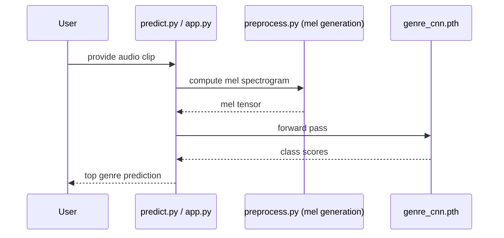

# Music Genre Classifier – Architecture

## Data & Training Flow
```mermaid
graph TD
    A[Raw audio\n(data/genres_original/*.wav)] --> B[preprocess.py\nlibrosa melspectrogram]
    B --> C[data/mels/<genre>/*.npy]
    C --> D[dataset.py\nGenreDataset -> tensors]
    D --> E[train.py\nDataLoader (train/val split)]
    E --> F[GenreCNN\n(conv + adaptive pool + FC)]
    F --> G[Optim/criterion\nAdam + CE + class weights]
    G --> H[genre_cnn.pth\n(best val loss checkpoint)]
    H --> I[evaluate.py\nconfusion matrix + metrics -> assets/]
    H --> J[predict.py / app.py\nsingle clip inference]
```

## Model (GenreCNN) Shape Overview
```mermaid
flowchart LR
    x[Input mel\n(1 x 128 x T)] --> c1[Conv 1x32 k=3 p=1]
    c1 --> bn1[BatchNorm] --> r1[ReLU] --> p1[MaxPool 2x2]
    p1 --> c2[Conv 32x64 k=3 p=1] --> bn2[BatchNorm] --> r2[ReLU] --> p2[MaxPool 2x2]
    p2 --> c3[Conv 64x128 k=3 p=1] --> bn3[BatchNorm] --> r3[ReLU] --> p3[MaxPool 2x2]
    p3 --> ap[AdaptiveAvgPool (8x8)]
    ap --> fl[Flatten]
    fl --> fc1[Linear 8192 -> 256] --> dr[Dropout 0.2] --> fc2[Linear 256 -> 10 logits]
```

## Inference Path


### Notes
- Preprocessing: `preprocess.py` uses librosa to build mel spectrogram `.npy` files under `data/mels/`.
- Training: `train.py` computes class weights from dataset, trains with Adam, and saves the best checkpoint by validation loss.
- Evaluation: `evaluate.py` loads `genre_cnn.pth`, runs on held-out test split, and writes confusion matrix/metrics to `assets/`.
- Inference: `predict.py`/`app.py` load the saved model and run a single-clip forward pass.
